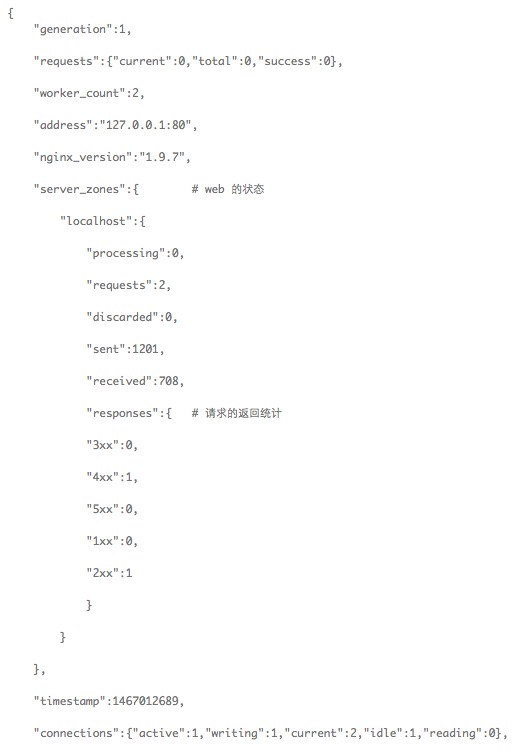
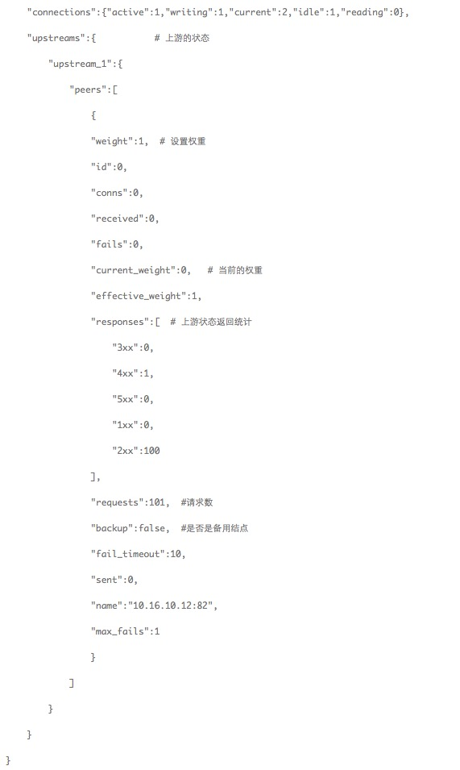

#NSight

NSight是一个可以用来监控 Nginx 运行状态，控制访问权限的开源项目。

 
#描述
Nginx 通常被用作反向代理服务器或者 Web 服务器，其负载和稳定性是大家最为关注的情况，NSight 是基于 [lua_nginx_module(openrestry)](http://openresty.org/en/)  而开发的 Nginx 状态监控应用，具有部署简单，性能折损低的特点。

#安装部署

1.需要将 [lua_nginx_module](https://github.com/openresty/lua-nginx-module) 和 [ngx_http_stub_status_module](http://nginx.org/en/docs/http/ngx_http_stub_status_module.html) 这两个模块编译到 Nginx 中，由于过程比较复杂，建议直接安装和编译 [OpenResty](http://openresty.org/en/) 这个项目，

2.将 NSight 中的 lua 文件夹拷贝到 conf 同级目录，将 conf/NSight.conf 拷贝到 conf 目录下，并在 nginx.conf 目录

3. 启动 nginx

4. 在浏览器中输入 http://ip:port/status, 看是否有返回结果

#返回值释义

/status 返回结果如下：

本项目只在单个 nginx 服务器上提供状态查询，请求统计，以及访问规则控制的接口，并不提供 UI 界面，如果需要 UI 来对多 Nginx 服务器集群进行管理请关注项目 [NSight-Console](https://github.com/aifeiasdf/NSight-Console)